# Bank Loan Report Dashboard

> A comprehensive Excel dashboard for monitoring, analysing, and visualising bank lending activities, loan portfolio health, and borrower insights — powered by real-world financial KPIs.
---

## Table of Contents

- [Project Overview](#-project-overview)
- [Problem Statement](#-problem-statement)
- [Dashboards](#-dashboards)
  - [Dashboard 1 — Summary](#dashboard-1--summary)
  - [Dashboard 2 — Overview](#dashboard-2--overview)
  - [Dashboard 3 — Details](#dashboard-3--details)
- [Key Performance Indicators (KPIs)](#-key-performance-indicators-kpis)
- [Good Loan vs Bad Loan Analysis](#-good-loan-vs-bad-loan-analysis)
- [Charts & Visualisations](#-charts--visualisations)
- [Data Fields & Terminologies](#-data-fields--terminologies)
- [Domain Knowledge](#-domain-knowledge)
- [Tech Stack](#-tech-stack)
- [Getting Started](#-getting-started)
- [Screenshots](#-screenshots)

---

## Project Overview

Bank loans are a crucial financial tool that enables individuals and businesses to achieve their goals and manage financial needs. This project builds a multi-page Bank Loan Report Dashboard to help financial analysts and decision-makers:

- Monitor and assess lending activities in real time
- Track KPIs such as funded amounts, repayments, and interest rates
- Distinguish between "Good" and "Bad" loans
- Identify regional, temporal, and demographic lending trends
- Support data-driven strategic decisions in loan portfolio management

---

## Problem Statement

The bank requires a comprehensive reporting system to monitor its lending operations. The report must:

1. Track key loan metrics and their month-over-month (MoM) changes
2. Classify loans as Good (Fully Paid / Current) or Bad (Charged Off)
3. Provide visual insights through interactive charts and maps
4. Offer a detailed grid view of all loan data for in-depth analysis

---

## Dashboards

### Dashboard 1 — Summary

> Provides a high-level overview of all lending KPIs, Good vs Bad Loan breakdowns, and a Loan Status Grid View.

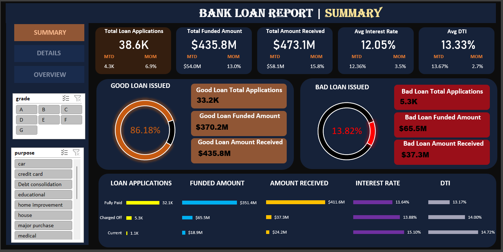

Includes:
- Total Loan Applications (MTD & MoM)
- Total Funded Amount (MTD & MoM)
- Total Amount Received (MTD & MoM)
- Average Interest Rate (MTD & MoM)
- Average Debt-to-Income Ratio / DTI (MTD & MoM)
- Good Loan vs Bad Loan KPI Cards
- Loan Status Grid View

---

### Dashboard 2 — Overview

> Visualises lending trends, regional distribution, loan purpose breakdown, and borrower demographics through interactive charts.

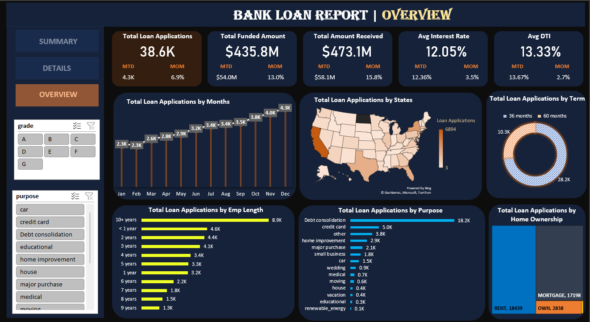

Includes:
- Monthly Trends Line Chart
- Regional Analysis Filled Map
- Loan Term Donut Chart
- Employment Length Bar Chart
- Loan Purpose Bar Chart
- Home Ownership Tree Map

---

### Dashboard 3 — Details

> A consolidated, drill-through table view of all loan records — a one-stop solution for accessing complete borrower and loan-level data.

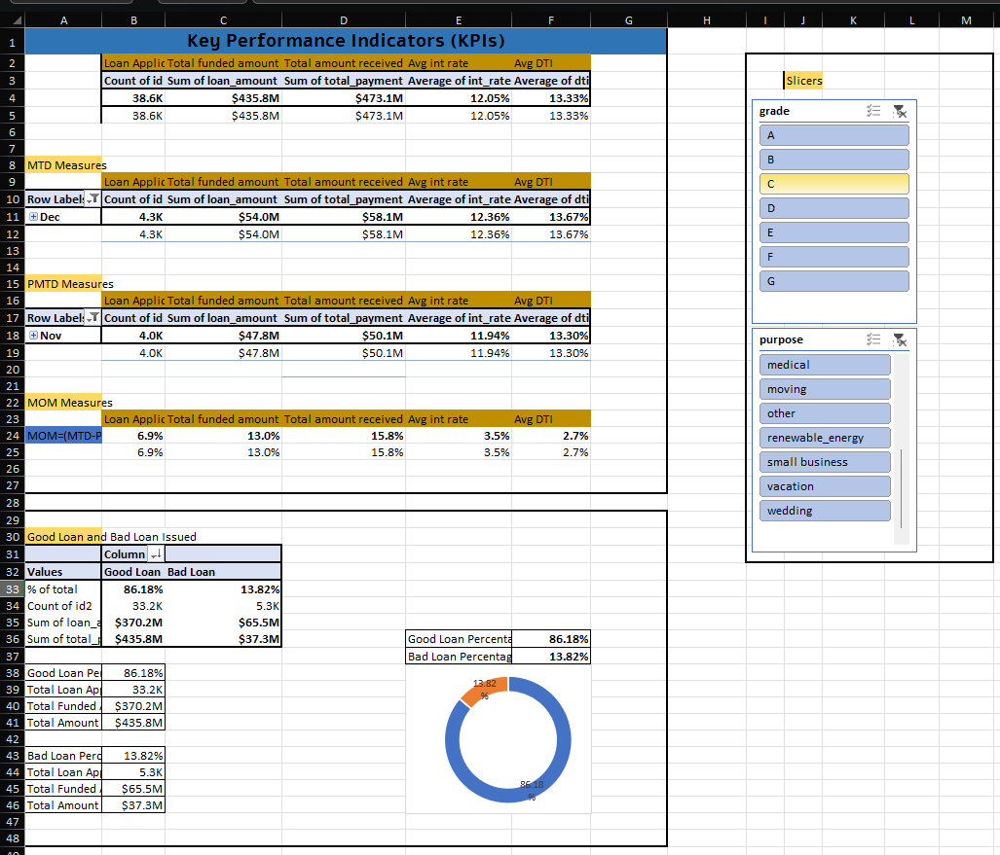
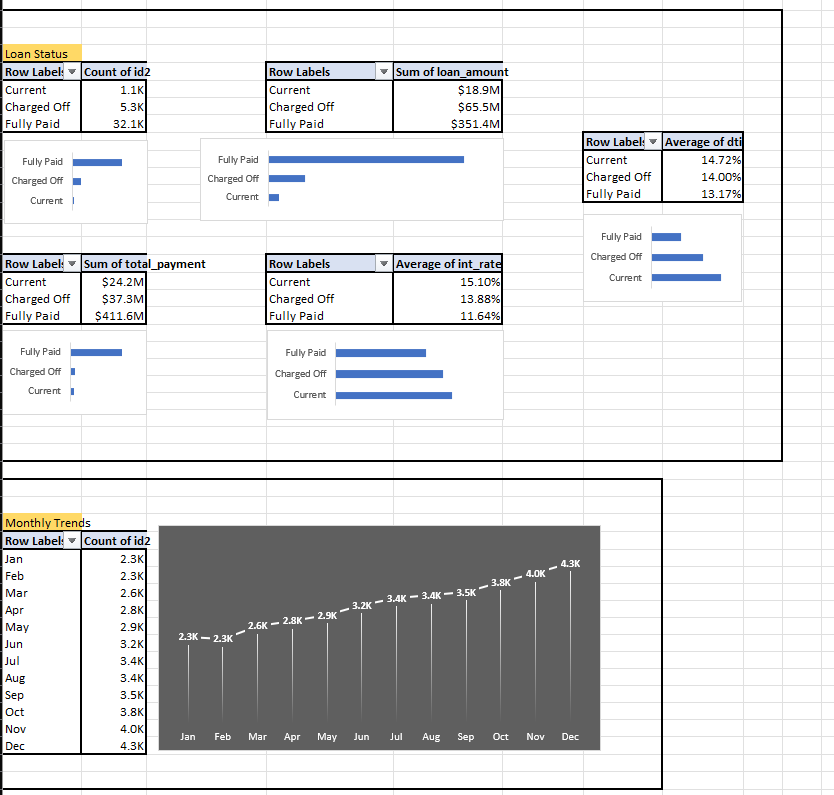
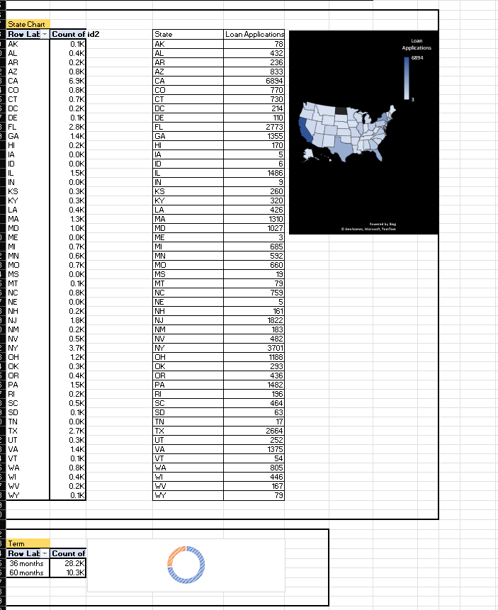
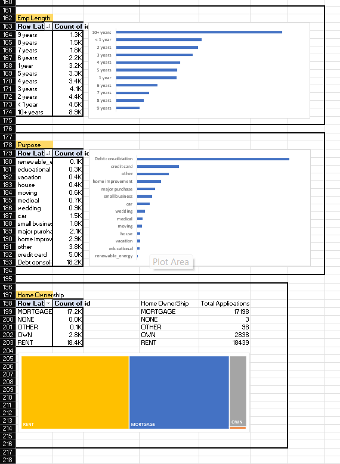

Includes:
- Full loan data grid with filters
- Borrower profile information
- Loan performance indicators
- Quick access to individual loan metrics

---

## Key Performance Indicators (KPIs)

| KPI | Description |
|-----|-------------|
| Total Loan Applications | Total applications received; tracked MTD and MoM |
| Total Funded Amount | Total funds disbursed as loans; tracked MTD and MoM |
| Total Amount Received | Total repayments collected from borrowers; tracked MTD and MoM |
| Average Interest Rate | Average annual interest rate across all loans; tracked MTD and MoM |
| Average DTI | Average Debt-to-Income ratio; measures borrowers' financial health; tracked MTD and MoM |

---

## Good Loan vs Bad Loan Analysis

### Good Loans
Loans classified as Fully Paid or Current

| Metric | Description |
|--------|-------------|
| Good Loan Application % | Percentage of total applications classified as Good Loans |
| Good Loan Applications | Total count of Good Loan applications |
| Good Loan Funded Amount | Total principal disbursed for Good Loans |
| Good Loan Total Received Amount | Total repayments collected from Good Loan borrowers |

### Bad Loans
Loans classified as Charged Off

| Metric | Description |
|--------|-------------|
| Bad Loan Application % | Percentage of total applications classified as Bad Loans |
| Bad Loan Applications | Total count of Bad Loan applications |
| Bad Loan Funded Amount | Total principal disbursed for Bad Loans |
| Bad Loan Total Received Amount | Total repayments collected from Bad Loan borrowers |

---

## Charts & Visualisations

### 1. Monthly Trends by Issue Date — Line Chart
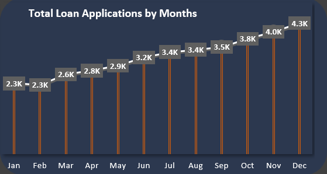

Tracks Total Loan Applications, Total Funded Amount, and Total Amount Received over time. Helps identify seasonality and long-term lending trends.

---

### 2. Regional Analysis by State — Filled Map
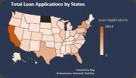

Visualises lending metrics across US states. Identifies high-activity regions and regional disparities in loan distribution.

---

### 3. Loan Term Analysis — Donut Chart
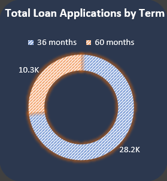

Breaks down loan distribution by term length (e.g., 36 months vs 60 months), showing borrower preference across term categories.

---

### 4. Employee Length Analysis — Bar Chart
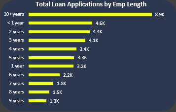

Shows how lending metrics vary across borrowers with different employment durations — from under 1 year to 10+ years.

---

### 5. Loan Purpose Breakdown — Bar Chart
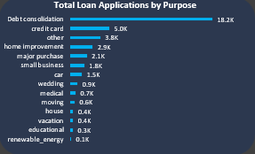

Illustrates the primary reasons borrowers seek loans — debt consolidation, credit card refinancing, home improvement, and more.

---

### 6. Home Ownership Analysis — Tree Map
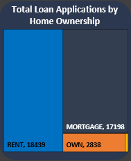

Displays loan metrics hierarchically by home ownership status: Own, Rent, or Mortgage.

---

## Data Fields & Terminologies

| Field | Purpose |
|-------|---------|
| Loan ID | Unique identifier for each loan application |
| Address State | Borrower's location for regional risk analysis |
| Employee Length | Employment duration — indicates job stability |
| Employee Title | Job title / occupation of the borrower |
| Grade | Risk classification based on creditworthiness (higher = lower risk) |
| Sub Grade | Finer risk differentiation within a grade |
| Home Ownership | Borrower's housing status (Own / Rent / Mortgage) |
| Issue Date | Loan origination date |
| Last Credit Pull Date | Most recent credit report access date |
| Last Payment Date | Date of the most recent loan payment |
| Loan Status | Current state: Fully Paid / Current / Charged Off |
| Next Payment Date | Estimated date of next payment — used for cash flow forecasting |
| Purpose | Stated reason for the loan (e.g., debt consolidation, education) |
| Term | Loan duration in months (e.g., 36 or 60 months) |
| Verification Status | Whether borrower's financial information has been verified |
| Annual Income | Borrower's total yearly earnings |
| DTI | Debt-to-Income Ratio — measures borrower's debt burden relative to income |
| Instalment | Fixed monthly repayment amount (principal + interest) |
| Interest Rate | Annual borrowing cost as a percentage |
| Loan Amount | Total principal amount borrowed |

---

## Domain Knowledge

Banks collect loan data through multiple channels:

- Loan Applications — Personal and financial info submitted by applicants
- Credit Reports — Pulled from credit bureaus to assess creditworthiness
- Internal Records — Disbursements, repayments, and status changes stored in the bank's database
- Online Portals — Digital platforms for loan applications and account management
- Third-Party Sources — External income verification and supplementary data

### Loan Granting Process
```undefined
Application → Review → Identity Check → Credit Check → Income Verification
     → DTI Assessment → Employment Verification → Risk Assessment
          → Approval / Denial → Loan Agreement → Disbursement → Repayment → Monitoring
```

### Why Banks Analyse Loan Data
- Risk Assessment — Predict default probabilities and set interest rates
- Decision-Making — Data-driven approval/denial of loan applications
- Portfolio Management — Monitor health of the overall loan book
- Fraud Detection — Flag unusual patterns and inconsistencies
- Regulatory Compliance — Meet HMDA, KYC, and other reporting obligations
- Profitability Analysis — Assess interest income vs. default losses
- Customer Retention — Identify refinancing or cross-sell opportunities

---

## Tech Stack

| Tool | Usage |
|------|-------|
| Microsoft Excel | Dashboard design, interactive visualisations, KPI calculations, and data analysis |

---


## Screenshots


| Dashboard | Preview |
|-----------|---------|
| Summary |  |
| Overview |  |
| Details |  |

---

## Project Structure

```
bank-loan-report-excel-dashboard/
│
├── Bank_Loan_Report.xlsx        # Main Excel dashboard file
├── data/
│   └── loan_data.csv            # Raw loan dataset
├── images/
│   ├── dashboard_summary.png
│   ├── dashboard_overview.png
│   ├── dashboard_details.png
│   ├── dashboard_details1.png
│   ├── dashboard_details2.png
│   ├── dashboard_details3.png
│   ├── chart_monthly_trends.png
│   ├── chart_regional_map.png
│   ├── chart_loan_term.png
│   ├── chart_employee_length.png
│   ├── chart_loan_purpose.png
│   └── chart_home_ownership.png
├── docs/
│   ├── Domain_Knowledge.docx
│   ├── Problem_Statement.docx
│   └── Terminologies_in_Data.docx
└── README.md
```

---

## Acknowledgements

## Acknowledgements

- Dataset sourced from [Kaggle](https://www.kaggle.com/) — used for analytical and educational purposes.
- Domain knowledge and problem statement inspired by YouTube tutorials on financial dashboard development.

---

*Designed to reflect production-level financial dashboards used in the banking industry.*
